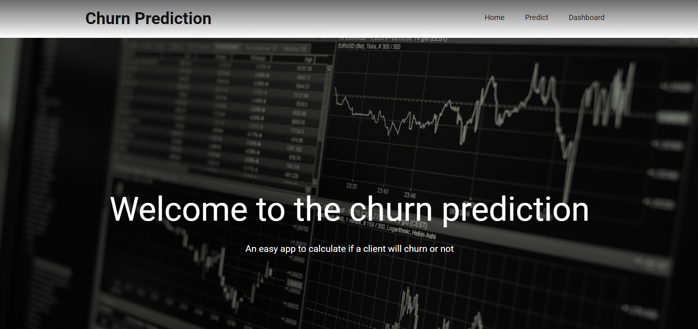
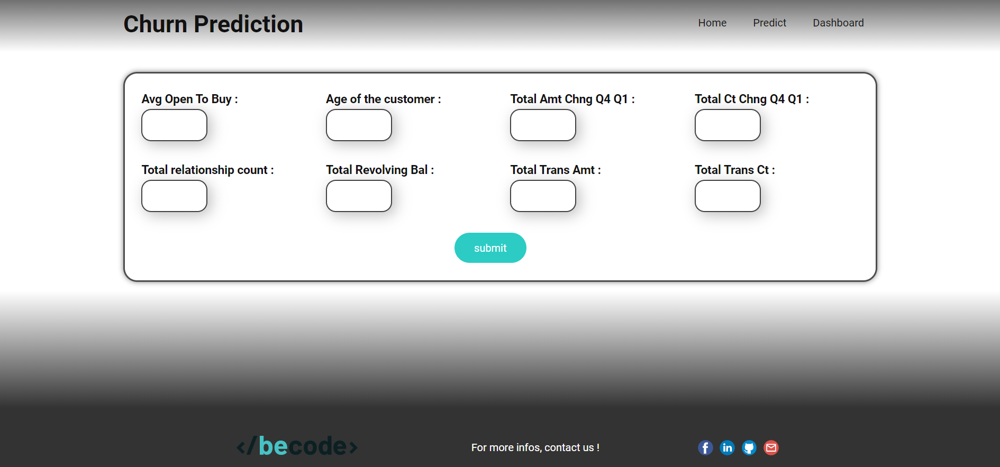
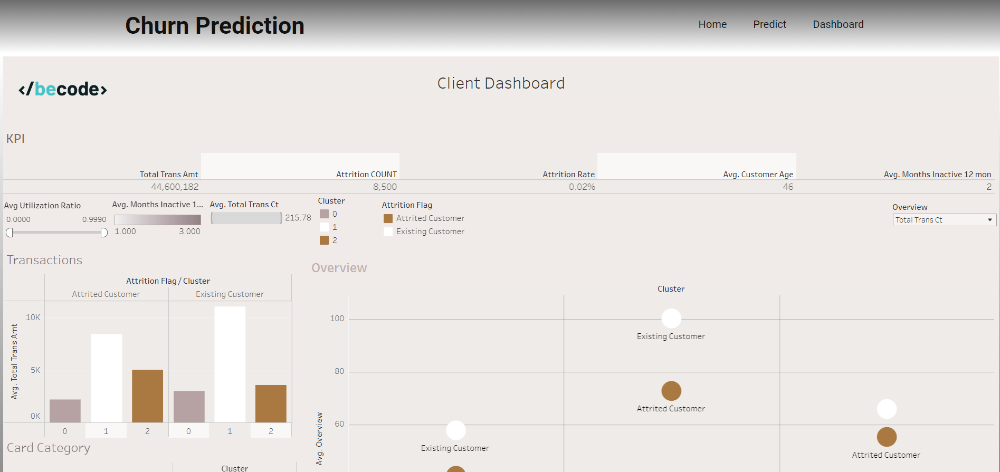

# ChurnPredictionProject

An application that predict if a client will churn and show datas about each client.

## Deployment

Build an API on the "app.py" fill using flask. This API contains 3 pages : Home, Predict, Dashboard. 
* Home :
  

* Predict :
  

* Dashboard : 
  

Predict has a form to enter information about a client then return the chance of this client to churn and his cluster category.
Dashboard show a page with a lot of usefull informations about the database of clients.

To see the API locally, you can run the "app.py" program and put the local url the terminal will give you on your browser (http://127.0.0.1:5000)

To create a Docker image with the dockerfile, you need to use these commands on your terminal in the "deployment" folder : 
* docker build -t churn_prediction_app .
* docker run -p 5000:5000 churn_prediction_app

### models

Contains the model used for the prediction

### static

Contains all the css and js for the HTML interface

### templates

Contains all the HTML pages

##

## 

## Authors

Contributors names and contact info

* Heritié
* Pyre Arthur
* Eloïse

## Timeline

* Beginning of the project => 20 february 2023
* End of the project => 2 march 2023
