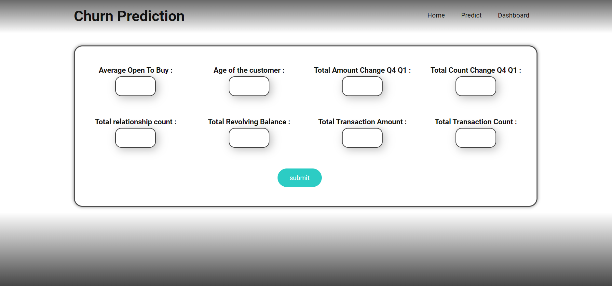
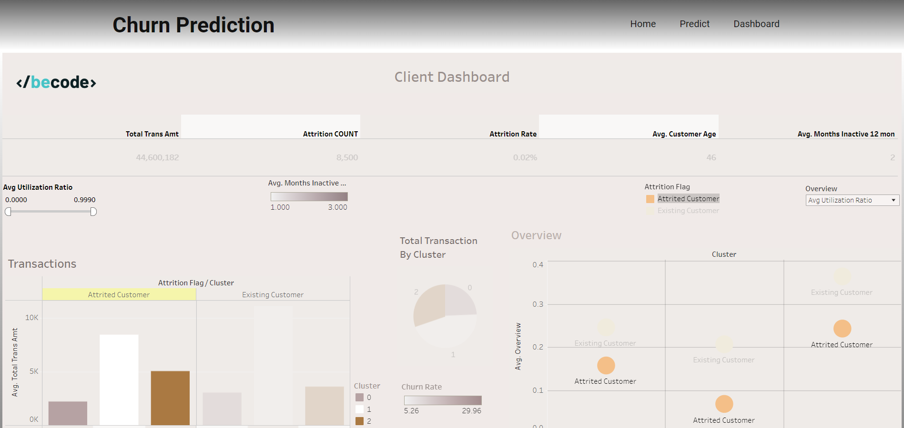

# ChurnPredictionProject

An application that predict if a client will churn and show datas about each client.

## Data analysis 

Tableau link: https://public.tableau.com/app/profile/heritie.kassanzi/viz/ClientDashboard_16775975534410/Dashboard1?publish=yes

Hereby I would like to give a brief explanation of my dashboard. It is divided into several charts:

Marital Status Cluster: This graph shows the number of transactions by gender and relationship status, broken down into the different relationship statuses.

Transactions: This barchart shows the average transaction amounts per cluster, divided between "Attrited Customer" and "Existing Customer".

Card Category: Here is shown how many months the clients were inactive per cluster and per card category. Again, this can be compared between "Attrited Customer" and "Existing Customer".

Total Transaction By Cluster: As the name implies, this chart shows the average number of transactions per cluster.

Overview: In this graph, I use a parameter to keep the overview. Here different things are displayed interactively depending on the option selected. Again, a distinction is made between "Attrited Customer" and "Existing Customer".

## Machine Learning Part 

The challenge for the machine learning was to come up with a churning rate for each client, what was the possibility of this client to churn ? Without any time information it was quite a difficult task. I decided to first create a classification model to recognize if a client is a attrite or an existing one. After that I did some exploration on clusters to find some pattern in the client data and see wich cluster had the most of attrited customer. All the algorithms used are from sklearn library and the data cleaningwas made with pandas

### Explorations 

#### Classification 
the classification model was a first exploration of the dataset, understand the main features related to the churning of clients to use them later. 
As the dataset was unbalanced the idea was the oversample it to have an equal distributions of Attrited or not. 
After that I did some grid search to define the model I will go with. I choose the Decision Tree, It is not the most fancy model but for this application It will work great enough(no need to use an overkill model). I also went for decision tree because it offer a big flexibility of visualisation of the results and of how it works on the inside. Here is a simplified version of the tree I used for my model. Helps to understand his choices. 

 

And it is also easy to understand and plot which features are the most important for the model. Here is a plot of all the features that I fed into the model, we can see that 8 of them are really used by the other have a negligent effect on the results so I choose these features to not overwhelmed the model and the metrics didn't drop. 

The Classification was straightforward enough to give insights on the database. But it wasn't enough to give a precise prediction of churning or a precise churning rate. All the explorations of the classification model are in this [Jupyter notebook](./ML/Notebook/classification.ipynb) and the final code cleaned that gives a prediction and save the final model is in this [Python File](./ML/Python%20files/Classification.py)

#### Clustering 
For the clustering part I wanted to make a version with all the features of the dataset and the features that I had choose for the classification. So I have 2 representations of my clusters. For the clustering the first step was to put everithing in the PCA algorithms to see wich features had the most inertia and see if a 2D plot was useful or not. I still did a 2plot ot visualize the clusters better. 
For the agorithms I decided to use K-means as It was the easier to understand (I tried with DBSCAN but results weren't useful). So the first thing with K-means is to know how many clusters are optimal by making an elbow plot: 

I decided to stay with 3 clusters because it was were the inertia started to stabilize. 
So here are my two different tries of the clustering algorithms. The first is the clusters with all the features and the second is the one with only the 8 features that I've chosen for the classification

With the informations of clusters it was possible to calculte the attrition rate by cluster so here is the table : 

The clustering permits us to find pattern into the type of clients, to relate informations of churning with financial comportements. All the explorations of the Clustering model are in this [Jupyter notebook](./ML/Notebook/clustering.ipynb) and the final code cleaned that gives a prediction and save the final model is in this [Python File](./ML/Python%20files/Clustering.py)

### Final reflections : 
THis database doesn't really need a Machine Learning solution. We are too limited by the dataset to make really interesting prediction. But apart from that it was interesting to get to make clusters and see wich type of client has a better chance to churn using this informations. To have relevant predictions or precise one we need Time information on each client. But the machine Learning helped us to get some insights on the databse more easily but it would have been possible to do that with data vizualisation. 

## Deployment

Build an API on the "app.py" fill using flask. This API contains 3 pages : Home, Predict, Dashboard. 
* Home :
  

* Predict :
  

* Dashboard : 
  

Predict has a form to enter information about a client then return the chance of this client to churn and his cluster category.
Dashboard show a page with a lot of usefull informations about the database of clients.

The site has been deployed on Render at this address : https://churn-prediction-app.onrender.com.

To see the API locally, you can run the "app.py" program in the deployement folder and put the local url the terminal will give you on your browser (http://127.0.0.1:5000)

To create a Docker image with the dockerfile, you need to use these commands on your terminal in the "deployment" folder : 
* docker build -t churn_prediction_app .
* docker run -p 5000:5000 churn_prediction_app

### models

Contains the model used for the prediction

### static

Contains all the css and js for the HTML interface

### templates

Contains all the HTML pages

## Authors

Contributors names and contact info

* [Héritier](https://github.com/Heririjk)
* [Athur Pyre](https://github.com/ArtPyre)
* [Héloïse Feldmann](https://github.com/Yheloww)

## Timeline

* Beginning of the project => 20 february 2023
* End of the project => 2 march 2023
